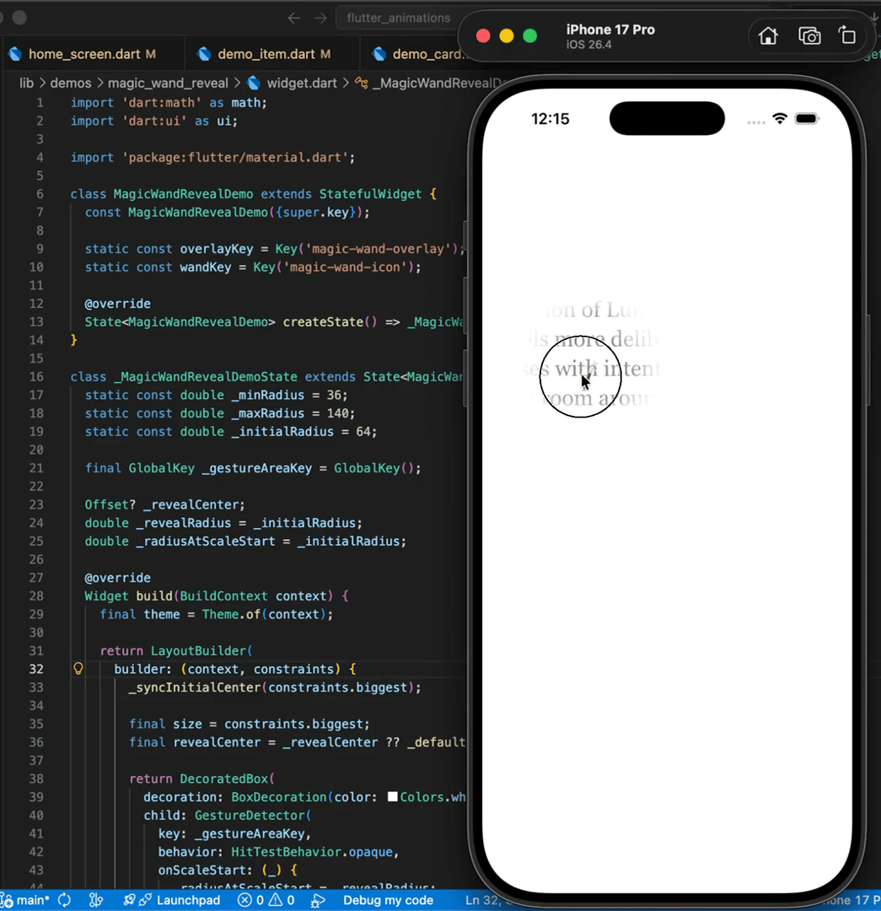

# Flutter Animations

A growing Flutter repo of small animation demos.

## Structure

```text
lib/
  app/
    app.dart
    router.dart
  features/
    home/
      models/
      views/
      widgets/
  demos/
```

## Workflow

1. Add a new demo folder under `lib/demos/`.
2. Build the animation in its own `view.dart` and `widget.dart`.
3. Register the route in `lib/app/router.dart`.
4. Add a `DemoItem` entry in `lib/features/home/views/home_screen.dart`.
5. Update this README when you publish the demo.

## Animations Gallery

### Magic Wand Reveal



[View Source Code](lib/demos/magic_wand_reveal/widget.dart)
